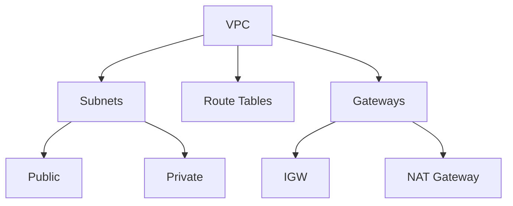

# AWS VPC Deep Dive: Subnets, Route Tables, Gateways


[](https://www.youtube.com/watch?v=0EdHPdzv2ko)

[Watch the video](https://www.youtube.com/watch?v=0EdHPdzv2ko)

## 🌐 What is a VPC?
A **Virtual Private Cloud (VPC)** is an isolated network within AWS where you can launch AWS resources. It's like having your own private network in the cloud, with full control over:
- IP addressing (CIDR block)
- Subnetting
- Routing
- Security & access controls

### 🛠️ When You Create a VPC, You Define:
- **CIDR block** (e.g., `10.0.0.0/16`)
- **Subnets**
- **Route Tables**
- **Gateways**

---

## 🧱 VPC Core Components

| Component            | Description                                                                 |
|----------------------|-----------------------------------------------------------------------------|
| **CIDR Block**       | Range of IPs in the VPC (e.g., `10.0.0.0/16`)                               |
| **Subnets**          | Logical divisions of the VPC into smaller address ranges                   |
| **Internet Gateway** | Enables internet access for public subnets                                 |
| **NAT Gateway**      | Allows private subnets to access the internet (outbound only)              |
| **Route Tables**     | Control traffic routing across the VPC                                      |

---

## 🧩 Subnets in VPC
A **subnet** is a segment of a VPC's IP range where AWS resources (like EC2) reside. Subnets help with isolation, security, and IP address management.

### 🧭 Subnet Types
| Type            | Description                                                                 |
|-----------------|-----------------------------------------------------------------------------|
| **Public**      | Connected to the Internet Gateway (e.g., web servers, load balancers)       |
| **Private**     | No direct internet access; uses NAT Gateway for outbound traffic            |
| **VPN-only**    | Connects to on-premise via VPN Gateway (no internet access)                |
| **Isolated**    | No internet or external VPC access (e.g., internal databases)              |

### 🧮 Subnet IP Addressing
- **VPC CIDR block**: `10.0.0.0/16` → Subnets: `10.0.1.0/24`, `10.0.2.0/24`, etc.
- AWS **reserves 5 IPs** in each subnet.

#### Reserved IPs (Example: `10.0.1.0/24`)
| IP Address    | Purpose                          |
|--------------|----------------------------------|
| `10.0.1.0`   | Network ID                       |
| `10.0.1.1`   | Default Gateway (VPC Router)     |
| `10.0.1.2`   | Reserved by AWS (DNS)            |
| `10.0.1.3`   | Reserved by AWS (Future Use)     |
| `10.0.1.255` | Broadcast (unused in AWS)        |

#### Usable IPs per Subnet
| Subnet CIDR | Total IPs | Reserved | Usable |
|------------|----------|----------|--------|
| `/28`      | 16       | 5        | 11     |
| `/24`      | 256      | 5        | 251    |
| `/22`      | 1024     | 5        | 1019   |

---

## 🚦 Route Tables
A **Route Table** defines traffic routing rules. Every subnet must be associated with one.

### 📘 Route Table Fields
- **Destination**: CIDR block (e.g., `0.0.0.0/0` for all traffic)
- **Target**: IGW, NAT Gateway, Local, etc.

### 🔧 Types of Route Tables
| Type            | Description                                                                 |
|-----------------|-----------------------------------------------------------------------------|
| **Main**        | Default route table (used by subnets without explicit association)          |
| **Custom**      | Created for specific subnets (e.g., isolating dev/prod)                    |

### � Example Routes
| Subnet Type | Destination | Target          |
|------------|-------------|-----------------|
| Public     | `0.0.0.0/0` | Internet Gateway|
| Private    | `0.0.0.0/0` | NAT Gateway     |

---

## 🌐 Gateways in VPC
| Gateway Type         | Purpose                                                                     |
|----------------------|-----------------------------------------------------------------------------|
| **Internet Gateway (IGW)** | Enables public subnets to access the internet                          |
| **NAT Gateway**      | Private subnets → Outbound internet (managed, HA, AZ-scoped)               |
| **NAT Instance**     | Legacy EC2-based NAT (manual setup)                                        |
| **Virtual Private Gateway (VGW)** | Site-to-Site VPN to on-premise                                |
| **Transit Gateway**  | Hub-and-spoke model for multiple VPCs/VPNs                                 |
| **VPC Peering**      | Direct connection between two VPCs (no transitive peering)                 |

---

## 🛠️ Example: VPC Setup with Public/Private Subnets
**Goal**: 1 Public Subnet + 1 Private Subnet with NAT.

### Step-by-Step
1. **Create VPC**  
   - CIDR: `10.0.0.0/16`

2. **Create Subnets**  
   - Public: `10.0.1.0/24` (AZ A)  
   - Private: `10.0.2.0/24` (AZ B)  

3. **Attach Internet Gateway**  
   - Create IGW → Attach to VPC  
   - Public Route Table: `0.0.0.0/0` → IGW  

4. **Deploy NAT Gateway**  
   - Launch in **Public Subnet**  
   - Allocate Elastic IP  
   - Private Route Table: `0.0.0.0/0` → NAT Gateway  

5. **Associate Route Tables**  
   - Public Subnet → Public RT (IGW)  
   - Private Subnet → Private RT (NAT GW)  

---

### 📚 Resources
- [AWS VPC Documentation](https://docs.aws.amazon.com/vpc/)
- [VPC CIDR Calculator](https://www.davidc.net/sites/default/subnets/subnets.html)


## 📦 Core Components


---

## 🔧 CLI Examples

### 1. Create a VPC
```bash
aws ec2 create-vpc \
  --cidr-block 10.0.0.0/16 \
  --tag-specifications 'ResourceType=vpc,Tags=[{Key=Name,Value=ProdVPC}]'
```
**Output:**  
```json
{
  "Vpc": {
    "CidrBlock": "10.0.0.0/16",
    "VpcId": "vpc-12345678"
  }
}
```

### 2. Create Subnets
```bash
# Public Subnet
aws ec2 create-subnet \
  --vpc-id vpc-12345678 \
  --cidr-block 10.0.1.0/24 \
  --availability-zone us-east-1a \
  --tag-specifications 'ResourceType=subnet,Tags=[{Key=Name,Value=PublicSubnet-A}]'

# Private Subnet
aws ec2 create-subnet \
  --vpc-id vpc-12345678 \
  --cidr-block 10.0.2.0/24 \
  --availability-zone us-east-1b \
  --tag-specifications 'ResourceType=subnet,Tags=[{Key=Name,Value=PrivateSubnet-B}]'
```

### 3. Attach Internet Gateway (IGW)
```bash
aws ec2 create-internet-gateway \
  --tag-specifications 'ResourceType=internet-gateway,Tags=[{Key=Name,Value=ProdIGW}]'

aws ec2 attach-internet-gateway \
  --internet-gateway-id igw-12345678 \
  --vpc-id vpc-12345678
```

### 4. Create NAT Gateway
```bash
# Allocate Elastic IP
aws ec2 allocate-address --domain vpc

# Create NAT Gateway in Public Subnet
aws ec2 create-nat-gateway \
  --subnet-id subnet-12345678 \
  --allocation-id eipalloc-12345678 \
  --tag-specifications 'ResourceType=natgateway,Tags=[{Key=Name,Value=ProdNAT}]'
```

### 5. Configure Route Tables
```bash
# Public Route Table (0.0.0.0/0 → IGW)
aws ec2 create-route-table \
  --vpc-id vpc-12345678 \
  --tag-specifications 'ResourceType=route-table,Tags=[{Key=Name,Value=PublicRT}]'

aws ec2 create-route \
  --route-table-id rtb-12345678 \
  --destination-cidr-block 0.0.0.0/0 \
  --gateway-id igw-12345678

# Private Route Table (0.0.0.0/0 → NAT Gateway)
aws ec2 create-route \
  --route-table-id rtb-87654321 \
  --destination-cidr-block 0.0.0.0/0 \
  --nat-gateway-id nat-12345678
```

---

## 📐 Network Diagrams

### Public/Private Subnet Architecture
```
+---------------------+       +---------------------+
|     Public Subnet   |       |    Private Subnet   |
| 10.0.1.0/24 (AZ A) |       | 10.0.2.0/24 (AZ B)  |
| +---------------+   |       | +---------------+   |
| |   EC2 Instance|   |       | |   EC2 Instance|   |
| | (Public IP)   |   |       | | (No Public IP)|   |
| +-------+-------+   |       | +-------+-------+   |
|         |           |       |         |           |
+---------|-----------+       +---------|-----------+
          |                             |
          | (Route: 0.0.0.0/0 → IGW)    | (Route: 0.0.0.0/0 → NAT)
+---------|-----------+       +---------|-----------+
|  Internet Gateway  |       |   NAT Gateway       |
|       (IGW)        |       |  (in Public Subnet) |
+---------------------+       +---------------------+
          |
+---------|-----------+
|       Internet      |
+---------------------+
```

## 🧪 Lab: Build a VPC with NAT

### Step 1: Create VPC
```bash
aws ec2 create-vpc --cidr-block 10.0.0.0/16
```

### Step 2: Create Subnets
```bash
aws ec2 create-subnet --vpc-id vpc-12345678 --cidr-block 10.0.1.0/24 --availability-zone us-east-1a
aws ec2 create-subnet --vpc-id vpc-12345678 --cidr-block 10.0.2.0/24 --availability-zone us-east-1b
```

### Step 3: Verify Subnets
```bash
aws ec2 describe-subnets --filters "Name=vpc-id,Values=vpc-12345678"
```

### Step 4: Cleanup (Optional)
```bash
aws ec2 delete-subnet --subnet-id subnet-12345678
aws ec2 delete-vpc --vpc-id vpc-12345678
```

---

## 📚 Resources
- [AWS CLI VPC Reference](https://awscli.amazonaws.com/v2/documentation/api/latest/reference/ec2/index.html)
- [VPC CIDR Calculator](https://www.davidc.net/sites/default/subnets/subnets.html)