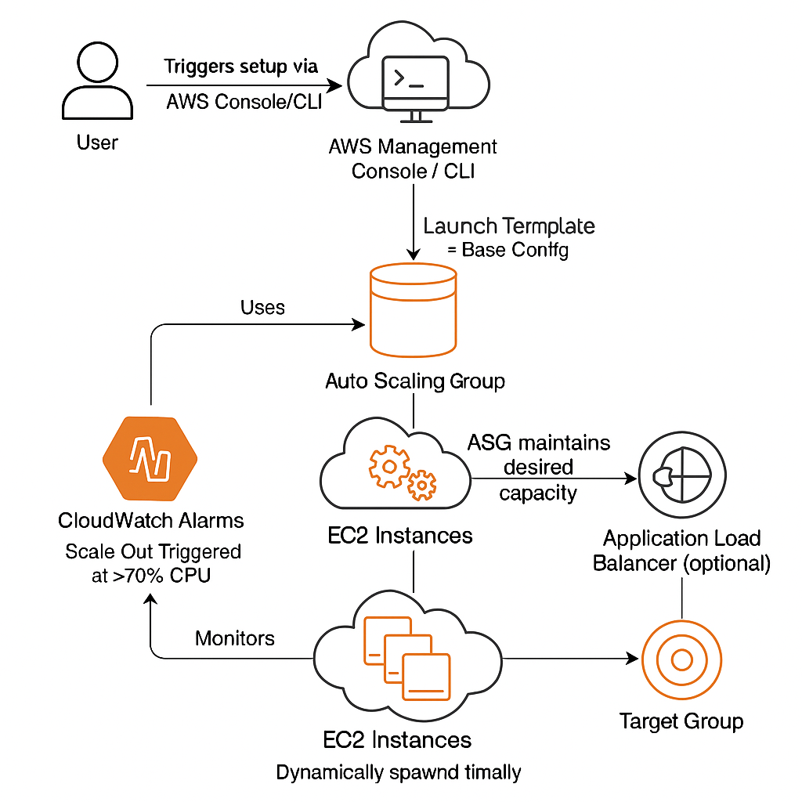

# 🚀 Day 8: Managing EC2 Instances and Auto Scaling

Managing EC2 instances and utilizing Auto Scaling are fundamental practices in AWS to ensure **high availability**, **fault tolerance**, and **cost optimization**. This guide covers EC2 management via GUI and CLI, Auto Scaling types and strategies, real-world use cases, and best practices.



[](https://www.youtube.com/watch?v=Wj0-Vkx0AKk)
---

## 🔍 Why Managing EC2 Instances is Important

1. **Cost Optimization** – Start/stop instances based on demand.
2. **Performance Management** – Resize instances for workload efficiency.
3. **Security Maintenance** – Apply patches and updates.
4. **Resource Utilization** – Monitor and analyze performance.
5. **Backup and Recovery** – Use AMIs and snapshots for resilience.

---

## 📈 Why Auto Scaling is Important

1. **High Availability** – Automatically replaces unhealthy instances.
2. **Cost Efficiency** – Scales in/out based on load.
3. **Improved Performance** – Maintains app performance under load.
4. **Fault Tolerance** – Balances traffic across instances.

---

## 🧠 Types of Auto Scaling

### 1. Dynamic Scaling
- **Target Tracking** – e.g., Maintain CPU at 50%.
- **Step Scaling** – Scale in steps (e.g., add 2 instances if CPU > 80%).
- **Simple Scaling** – Triggered by thresholds.

### 2. Scheduled Scaling
- Set based on time, e.g., scale up at 9 AM and scale down at 9 PM.

### 3. Predictive Scaling
- Uses ML to anticipate load spikes and scale proactively.

---

## ⚖️ Auto Scaling Approaches

| Feature                | Horizontal Scaling         | Vertical Scaling             |
|------------------------|----------------------------|------------------------------|
| Definition             | Adds/removes instances     | Resize the current instance  |
| Scalability            | Near-infinite              | Limited by hardware          |
| Performance            | Handles large-scale loads  | Best for compute-heavy apps  |
| Cost                   | Cost-efficient for traffic | Expensive for high specs     |
| Complexity             | Requires Load Balancer     | Easier but limited           |
| Use Case               | Web apps, microservices    | Databases, single-threaded   |

---

## 🎯 Scenarios for Auto Scaling

- E-commerce sites during peak sales.
- Batch processing jobs.
- Analytics pipelines with variable loads.
- Microservices scaling per service.

---

## 🧩 Components of Auto Scaling

1. **Launch Template/Config** – Instance settings like AMI, type, key pair.
2. **Auto Scaling Group (ASG)** – Core unit managing EC2 instances.
3. **Scaling Policies** – Define how/when to scale:
   - Target Tracking
   - Step Scaling
   - Scheduled Scaling

### Auto Scaling Group Parameters

- **Desired Capacity** – Target number of instances.
- **Min/Max Capacity** – Lower and upper bounds.
- **Policies** – Trigger-based rules for scaling.

---

## 🛠️ Managing EC2 Instances

### ✅ GUI Method (AWS Console)

1. **Start/Stop/Reboot**  
   - EC2 Dashboard → Instances → Actions → Start/Stop/Reboot

2. **Resize**  
   - Stop → Actions → Instance Settings → Change Instance Type → Start

3. **Monitor**  
   - Monitoring tab: View CPU, I/O, network metrics

---

### 🧰 CLI Method

#### Filter by Instance Type
```bash
aws ec2 describe-instances \
  --filters "Name=instance-type,Values=t2.micro" \
  --query "Reservations[*].Instances[*].[InstanceId]" \
  --output text
```

#### Start / Stop / Reboot
```bash
aws ec2 start-instances --instance-ids i-1234567890abcdef0
aws ec2 stop-instances --instance-ids i-1234567890abcdef0
aws ec2 reboot-instances --instance-ids i-1234567890abcdef0
```

#### Resize Instance
```bash
aws ec2 stop-instances --instance-ids i-1234567890abcdef0
aws ec2 modify-instance-attribute --instance-id i-1234567890abcdef0 --instance-type t3.medium
aws ec2 start-instances --instance-ids i-1234567890abcdef0
```

#### Check Status
```bash
aws ec2 describe-instance-status --instance-id i-1234567890abcdef0
```

---

## 🔄 Auto Scaling in AWS

### Step 1: Create Launch Configuration/Template

#### ✅ GUI
- EC2 Dashboard → Auto Scaling Groups → Launch Configs/Templates → Create

#### 🧰 CLI
```bash
aws autoscaling create-launch-configuration \
  --launch-configuration-name my-launch-config \
  --image-id ami-12345678 \
  --instance-type t2.micro
```

---

### Step 2: Create Auto Scaling Group

#### ✅ GUI
- Auto Scaling Groups → Create → Select Launch Config → Set Capacity + Subnets → Review & Create

#### 🧰 CLI
```bash
aws autoscaling create-auto-scaling-group \
  --auto-scaling-group-name my-asg \
  --launch-configuration-name my-launch-config \
  --min-size 1 --max-size 5 --desired-capacity 2 \
  --vpc-zone-identifier subnet-12345abc,subnet-67890def
```

---

### Step 3: Configure Scaling Policies

#### ✅ GUI
- Auto Scaling Group → Automatic Scaling → Add Policy

#### 🧰 CLI (Target Tracking)
```bash
aws autoscaling put-scaling-policy \
  --auto-scaling-group-name my-asg \
  --policy-name my-scaling-policy \
  --policy-type TargetTrackingScaling \
  --target-tracking-configuration '{"PredefinedMetricSpecification": {"PredefinedMetricType": "ASGAverageCPUUtilization"}, "TargetValue": 50.0}'
```

---

### Step 4: Monitor Auto Scaling

#### ✅ GUI
- Auto Scaling Group → Monitoring tab

#### 🧰 CLI
```bash
aws cloudwatch describe-alarms --alarm-name-prefix "my-asg"
```

---

### Step 5: Delete Auto Scaling Group

#### ✅ GUI
- Auto Scaling Group → Actions → Delete

#### 🧰 CLI
```bash
aws autoscaling delete-auto-scaling-group --auto-scaling-group-name my-asg --force-delete
```

---

## ✅ Benefits of Auto Scaling

- ✅ Ensures high availability
- 🔄 Automatically adjusts to demand
- 💰 Cost-effective
- 💡 Reliable and responsive

---

## 🌐 Real-World Use Cases

| Use Case               | How Auto Scaling Helps                     |
|------------------------|--------------------------------------------|
| E-commerce             | Handles traffic surges during sales        |
| Streaming Services     | Scales based on viewer count               |
| Data Pipelines         | Adds compute power dynamically             |
| Microservices          | Individual service scaling per traffic     |

---

## 🧠 Best Practices

- 🎯 Set realistic thresholds to avoid over-scaling.
- 🌍 Use Multi-AZ for high availability.
- 📊 Monitor using CloudWatch alarms.
- 🧪 Test scaling policies frequently.
- 🔁 Integrate with CI/CD pipelines.

---

## 🧪 Hands-On Lab: Real-Time Example

### Scenario: Black Friday Scaling

1. **Launch EC2**
   - AMI: ubuntu
   - Type: `t2.micro`
   - Install Apache:  
     ```bash
     sudo apt install apache2 -y
     sudo systemctl start apache2
     ```

2. **Create Launch Template**
   - Add startup script to install Apache in User Data.

3. **Set Up Auto Scaling Group**
   - Min: 1, Desired: 2, Max: 5
   - Target Tracking: CPU > 50% scale out, < 20% scale in

4. **Simulate Load**
   ```bash
   sudo yum install stress -y
   stress --cpu 4 --timeout 60
   ```

5. **Observe Scaling**
   - View Auto Scaling in action via Console/CLI

6. **Clean Up**
   - Delete Auto Scaling Group and Launch Template

---

## 📘 AWS CLI Cheat Sheet

### Basic Syntax
```bash
aws ec2 describe-instances [OPTIONS]
```

### Common Filters
```bash
--filters "Name=instance-state-name,Values=running"
--filters "Name=tag:Environment,Values=Dev"
--filters "Name=instance-type,Values=t2.micro"
```

### Query Examples
```bash
aws ec2 describe-instances \
  --query "Reservations[*].Instances[*].[InstanceId,State.Name]" \
  --output table
```

### Output Formats
```bash
--output json
--output table
--output text
```

---

## 📎 Pro Tips

- Combine filters, queries, and output to fine-tune data.
- Use `--dry-run` for permission checks.
- Use tags for better resource tracking and filtering.
- Use pagination wisely for large outputs.

---
